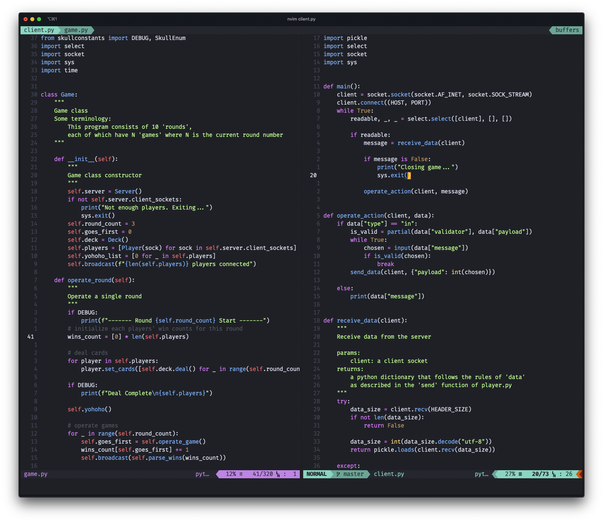

# onedarkpaco.vim

a high-contrast onedark colorscheme for Vim / Neovim - based on [joshdick's](https://github.com/joshdick) [onedark.vim](https://github.com/joshdick/onedark.vim)

screenshot taken in [iTerm2](https://www.iterm2.com/) with [Fira Code](https://github.com/tonsky/FiraCode) as font and [night_owl](https://github.com/vim-airline/vim-airline-themes/blob/master/autoload/airline/themes/night_owl.vim) as airline theme

# Installation
Install using your favorite package manager

### Using [vim-plug](https://github.com/junegunn/vim-plug)
```
Plug 'pacokwon/onedarkpaco.vim'
```

### Installing manually
Install the color scheme manually by placing `colors/onedarkpaco.vim` in your `colors` directory and `autoload/onedarkpaco.vim` in your `autoloads` directory
